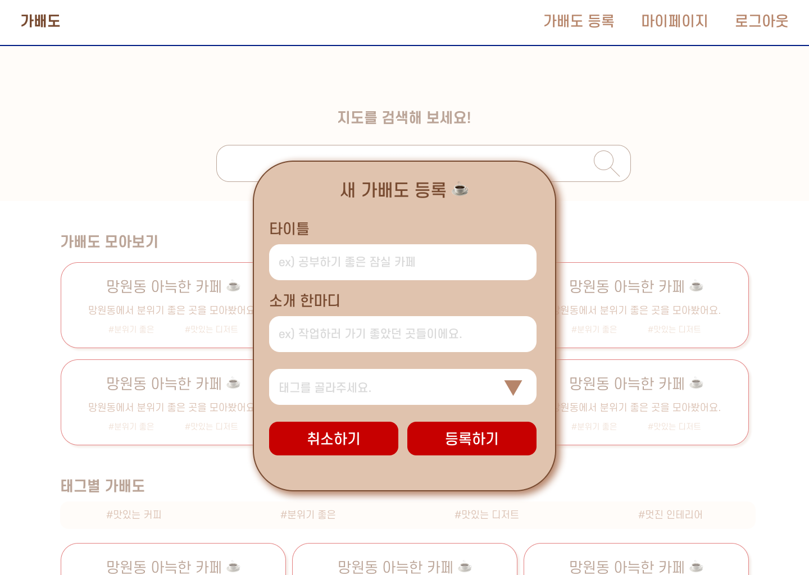
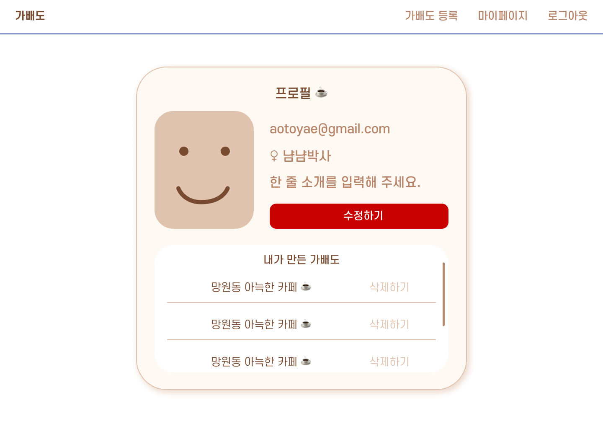
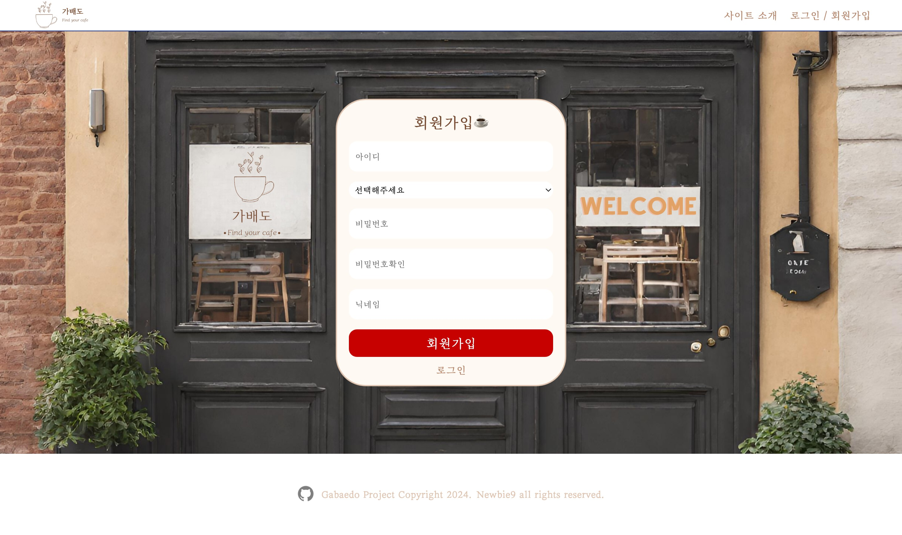

# 

 

# 프로젝트 소개

- 프로젝트 명 : GABAEDO
- 프로젝트 기간 : 2024.02.23 ~ 02.29 (7일)
- 프로젝트 소개 : 서울의 카페를 주제별로 모아보고 공유하는 사이트

- 배포 링크 : https://gabaedo-1.vercel.app
    

|                                                 김소현                                                  |                                                 김연재                                                 |                                                 김형민                                                  |                                                 박지영                                                  |                                                 정보연                                                  |
| :-----------------------------------------------------------------------------------------------------: | :----------------------------------------------------------------------------------------------------: | :-----------------------------------------------------------------------------------------------------: | :-----------------------------------------------------------------------------------------------------: | :-----------------------------------------------------------------------------------------------------: |
| 

 | 

 | 

 | 

 | 

 |
|                               [@aotoyae](https://github.com/aotoyae)                                |                                 [@YEONJAE](https://github.com/porosadporosad)                                 |                              [@C1oudys](https://github.com/C1oudys)                              |                                 [@jypark](https://github.com/redberry0217)                                  |                                 [@developeryeon](https://github.com/developeryeon)                                 |
|                                                  팀장                                                   |                                                 팀원                                                 |                                                  팀원                                                   |                                                  팀원                                                   |                                                  팀원                                                   |
|               - 메인페이지   - 메인페이지 모달   - 지도페이지 API   - 시연영상              |                 - 로그인 및 회원가입   - 헤더, 푸터   - README작성   - 배포                  |                         - 메인페이지 검색   - 지도페이지 장소검색                        |     - 지도페이지 API   - 지도페이지 장소추가   - 소개페이지   - 발표      |                    - 마이 페이지   - 닉네임 및 프로필 변경                  |

  

# 💻️ 사용된 기술

* React
* React-Query
* React toastify
* Axios
* Styled-components
* Firebase
* Kakao Map API
* Youtube API

# 와이어프레임

<table>
  <thead>
    <tr>
      <th>
        메인 페이지
      </th>
      <th>
        메인 페이지 모달
      </th>
      <th>
        로그인 페이지
      </th>
      <th>
        마이 페이지
      </th>
      <th>
        상세 페이지
      </th>
    </thead>
  <tbody>
  </tr>
  <tr>
    <td>
      
    </td>
    <td>
      
    </td>
    <td>
     
    </td>
       <td>
       
    </td>
       <td>
      
    </td>
  </tr>
  </tbody>
</table>

 

# 📃 페이지와 기능
  

## 1. 메인 페이지

 <table>
<thead>
  <tr>
    </thead>
  <tbody>
  </tr>
  <tr>
    <td>
      
    </td>
  </tr>
  </tbody>
</table>

<h3> 1-1. 메인 페이지 </h3>
 <ul>
 <li> 게시글은 태그별, 전체보기, 해시태크별 등 다양한 주제로 정렬 가능 </li>  
 <li> 검색을 통해 원하는 카페만 보기 가능 </li>
 <li> 작성 글 순위는 5명까지 보기 가능  </li>
 
 </ul>
   

 <table>
  <thead>
    <tr>
      <th>
        메인 페이지 모달
      </th>
    </tr>
  </thead>
  <tbody>
    <tr>
      <td>
       
      </td>
    </tr>
  </tbody>
</table>

<h3> 1-2. 메인 페이지 모달 </h3>
 <ul>
 <li> 게시글 작성 모달창 </li>  
 <li> 제목과 소개 한마디, 태그 설정이 가능 </li>
  

  
     

 ## 2. 로그인 페이지
 <table>
  <thead>
    <tr>
      <th>
        로그인
      </th>
      <th>
        회원가입
      </th>
    </tr>
  </thead>
  <tbody>
    <tr>
      <td>
       
      </td>
      <td>
       
      </td>
    </tr>
  </tbody>
</table>
  <ul>
    <li>
     firebase authentication 및 firestore를 사용한 로그인 및 회원가입 기능 구현
     <li>
      <h4>로그인</h4>
      <ul>
            <li>
            헤더의 로그인/회원가입 클릭 시  로그인 페이지로 이동
            </li>
            <li>
           이메일/비밀번호 로그인: 회원 존재 여부 확인 후 로그인
            </li>
            </k>
      </ul>
    </li>
     <li>
      <h4>회원가입</h4>
      <ul>
        <li>회원가입 클릭 시 회원가입 활성화 </li>
        <li>이메일 형식 여부 및 아이디 중복 여부, 비밀번호 일치여부를 확인</li>
      </ul>
    </li>
  </ul>
    

  
    

## 3. 마이페이지

  <table>
<thead>
    </thead>
  <tbody>
  </tr>
  <tr>
    <td>
     
    </td>
  </tr>
  </tbody>
</table>

<ul>
<li> 나의 가입정보, 활동정보 확인 </li>
<li> 닉네임, 프로필 현재 상태 수정 </li>
<li> 작성한 게시글 모아보기 및 삭제하기 </li>

</ul>
    

## 4. 상세 페이지

  <table>
<thead>
    </thead>
  <tbody>
  </tr>
  <tr>
    <td>
      
    </td>
   <td>
      
    </td>
  </tr>
  </tbody>
</table>
<h3> 4-1. 상세 페이지 </h3>
<ul>
 <li> 게시글 클릭시 상세 페이지로 이동 </li>
 <li> 게시글에 등록된 장소를 지도에 표시 </li>
 <li> 북마크 표시하고 해제하기 </li>
 <li> 지도 마커 클릭시 해당 카페 이름 유튜브 검색 결과 출력 </li>
 </ul>
  

<h3> 4-2. 카페 추가하기 </h3>
  <table>
  <tbody>
  <tr>
    <td>
        
    </td>
  </tr>
  </tbody>
</table>
  
  <ul>
  <li> 카페 이름 키워드로 검색하기 </li>
  <li> 원하는 카페 게시글 추가하기 </li>
  </ul>
 

<h3> 4-3. 게시물 수정 </h3>
  <table>
  <tbody>
  <tr>
    <td>
        
    </td>
  </tr>
  </tbody>
</table>
   <ul>
  <li> 제목, 한마디, 태그 수정 가능  </li>
  </ul>
    

## 5. 소개페이지

  <table>
<thead>
    </thead>
  <tbody>
  </tr>
  <tr>
    <td>
     
    </td>
  </tr>
  </tbody>
</table>

<ul>
<li> 페이지 소개 글 작성 </li>
<li> 제작자들의 한마디 </li>

</ul>
    

## ❗ 어려웠던 점
- 파이어베이스와 카카오맵API, 유튜브API를 활용하여 유저 데이터를 생성하고 수정, 및 삭제하는 것이 어려우면서도 재미있었습니다. 특히 카카오맵에서 다양하게 제공하는 기능을 가지고 적재적소에서 활용하는 것이 쉽지 않았습니다.
- 프로필사진을 변경했을 때 바로 렌더링 되지 않았던 부분에서 많이 당황스러웠고, 어려웠습니다.
